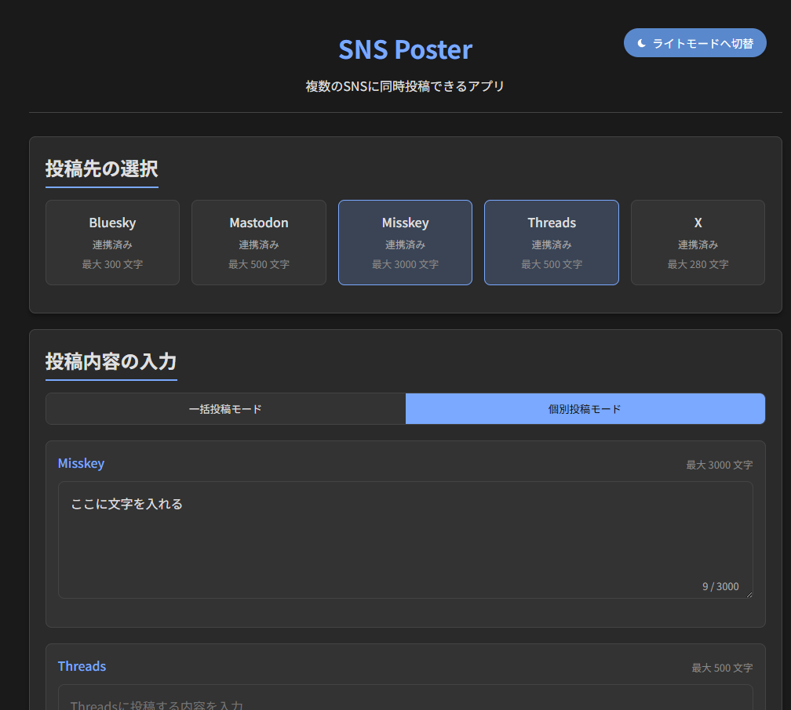

# SNS Poster App

複数のSNSプラットフォームに同時投稿できるWebアプリケーション。
簡易的な文章投稿専用アプリになります。

## 概要



SNS Poster Appは、複数のSNSアカウント（Bluesky、X/Twitter、Threads、Misskey、Mastodon）を連携させ、一度の操作で複数のプラットフォームに同時投稿できるアプリケーションです。Docker環境で簡単に起動でき、各SNSの文字数制限に対応した投稿フォームを備えています。

## 機能

- **複数SNSへの同時投稿**: 5つのプラットフォーム（Bluesky、X/Twitter、Threads、Misskey、Mastodon）対応
- **文字数制限チェック**: 各SNSの文字数制限に合わせたリアルタイムチェック
- **一括/個別投稿モード**: 全プラットフォームに同じ内容を投稿するか、プラットフォームごとに異なる内容を投稿するかを選択可能
- **プラットフォーム選択UI**: チェックボックスでSNSを個別に選択可能
- **Docker対応**: コンテナ化されており、環境に依存せず簡単に起動可能
- **DarkMode対応**: 使いやすいUIに設計しています。。

## システム要件

- Docker および Docker Compose
- インターネット接続（各SNS APIへのアクセス用）

## インストールと起動方法

### 1. リポジトリのクローン

```bash
git clone https://github.com/naomina121/sns-multi-post.git
cd sns_poster_app
```

### 2. 環境変数の設定

`backend/.env.example`ファイルを`backend/.env`としてコピーし、各SNSの認証情報を設定します：

```bash
cp backend/.env.example backend/.env
```

`.env`ファイルを編集して、以下の項目を設定してください：

```
# Bluesky
BLUESKY_USERNAME=
BLUESKY_PASSWORD=

# X/Twitter
X_API_KEY=
X_API_SECRET=
X_ACCESS_TOKEN=
X_ACCESS_TOKEN_SECRET=

# Threads (via Instagram API)
THREADS_ACCESS_TOKEN=

# Misskey
MISSKEY_API_TOKEN=
MISSKEY_INSTANCE_URL=https://misskey.io/

# Mastodon
MASTODON_ACCESS_TOKEN=
MASTODON_INSTANCE_URL=https://mastodon.sosial/

# Flask settings(ランダムな文字列)
FLASK_SECRET_KEY=
```

### 3. Dockerでの起動

```bash
docker-compose up --build
```

### 4. アプリケーションへのアクセス

ブラウザで以下のURLにアクセスします：

```
http://localhost:5001
```

## 使用方法

1. **SNSプラットフォームの選択**:
   - 投稿したいSNSプラットフォームをチェックボックスで選択します
   - 連携していないプラットフォームはグレーアウト表示され選択できません

2. **投稿モードの選択**:
   - **一括投稿モード**: すべてのプラットフォームに同じ内容を投稿
   - **個別投稿モード**: 各プラットフォームに異なる内容を投稿

3. **投稿内容の入力**:
   - 文字数制限はリアルタイムで表示され、制限に近づくと警告が表示されます
   - 一括投稿モードでは、最も小さい文字数制限が適用されます

4. **投稿**:
   - 「投稿する」ボタンをクリックして投稿を実行
   - 投稿結果は画面下部に表示されます

## ファイル構成

```
sns_poster_app/
 ├── backend/              # バックエンド（Flask）
 │   ├── app.py           # Flaskアプリケーションのメインコード
 │   ├── requirements.txt # 必要なPythonライブラリのリスト
 │   ├── utils.py         # SNS API連携用の補助関数
 │   └── .env             # 環境変数（APIキーなど）
 ├── frontend/            # フロントエンド
 │   ├── index.html       # メインのHTMLファイル
 │   └── style.css        # CSSスタイル
 ├── script.js            # フロントエンド用JavaScriptコード
 ├── Dockerfile           # Dockerイメージ構築用設定
 ├── docker-compose.yml   # Docker Compose設定
 └── .gitignore           # Git除外設定
```

## 技術スタック

- **バックエンド**:
  - Flask (Python)
  - 各SNS用APIライブラリ:
    - atproto: Bluesky用
    - tweepy: X/Twitter用
    - misskey.py: Misskey用
    - mastodon.py: Mastodon用

- **フロントエンド**:
  - HTML5
  - CSS3
  - JavaScript (ES6+)

- **インフラ**:
  - Docker
  - Docker Compose

## API対応状況

| プラットフォーム | API状況 | 備考 |
|--------------|---------|------|
| Bluesky      | 公式API | atproto ライブラリを使用 |
| X / Twitter  | 公式API | tweepy ライブラリを使用 |
| Threads      | 公式API | Threads ライブラリを使用 |
| Misskey      | 公式API | misskey.py ライブラリを使用 |
| Mastodon     | 公式API | mastodon.py ライブラリを使用 |

## 注意事項

- 各SNSのAPIキーや個人認証情報は`.env`ファイルで管理し、Gitリポジトリにはコミットしないでください
- 各SNSプラットフォームのAPI利用制限に注意してください
- 本番環境で使用する際は、適切なセキュリティ対策を施してください

## カスタマイズ方法

### 新しいSNSプラットフォームの追加

1. `utils.py`の`CHARACTER_LIMITS`辞書に新しいプラットフォームと文字数制限を追加
2. `SnsClient`クラスに新しいクライアント初期化と投稿メソッドを実装
3. フロントエンドのUIを更新

### ※ これらは実装されていません。

- 画像や動画の投稿機能
- 投稿予約機能
- 過去の投稿履歴管理
- 投稿分析ダッシュボード
- ハッシュタグやメンション補完機能

## ライセンス

このプロジェクトは[MITライセンス](LICENSE)の下で公開されています。

---

各、SNSのAPIキーの取得などの設定方法については、公式の開発者向けドキュメントでお調べください。